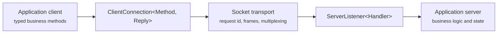
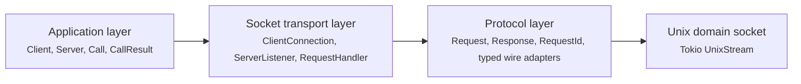
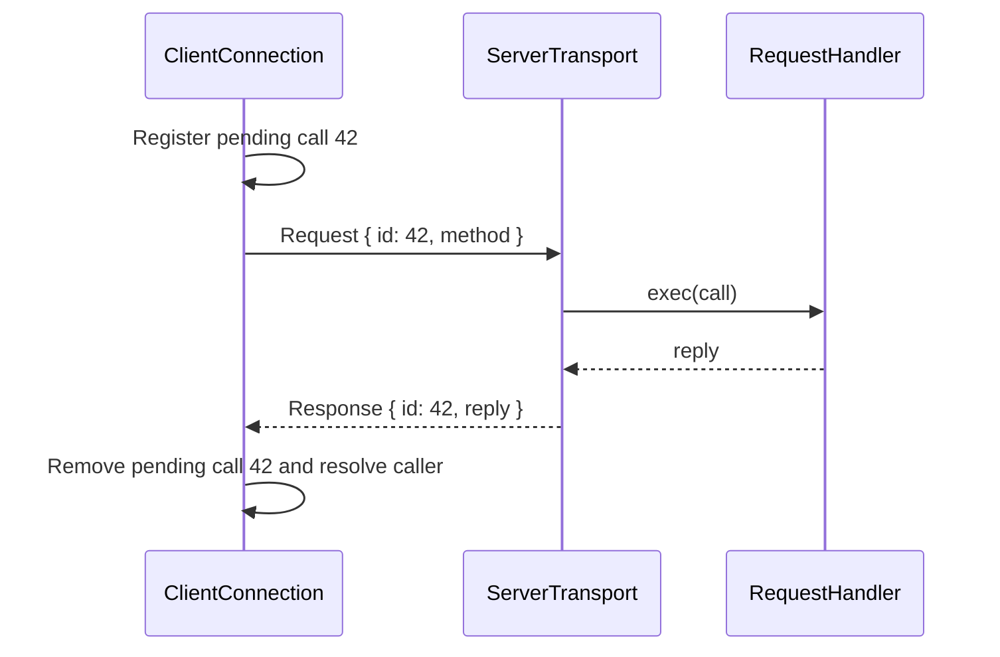
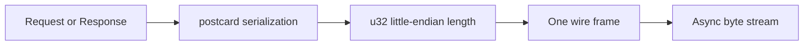
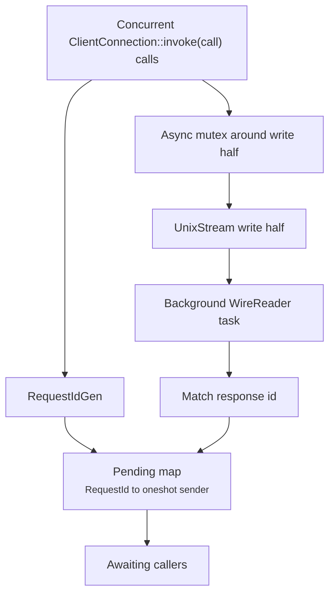
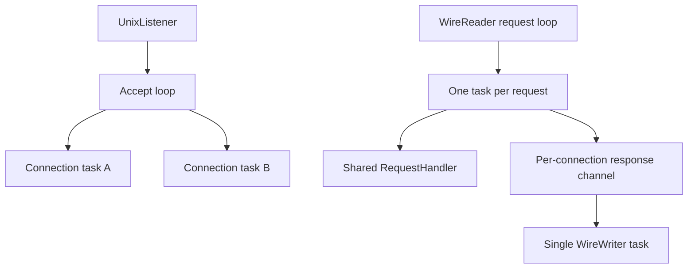
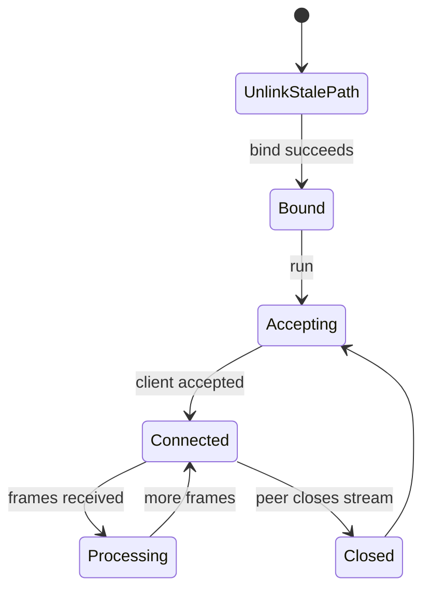

# IPC Socket Design

This guide describes the Unix domain socket request and response transport implemented in `handbook/samples/ipc-socket-design/`.

The design provides typed application calls over one multiplexed local socket connection. It separates application behavior from transport concerns such as framing, request correlation, concurrent calls, and connection lifecycle.

The framing boundary uses Tokio's `LengthDelimitedCodec` behind internal typed `WireReader` and `WireWriter` adapters. The adapters preserve postcard payloads and the existing transport architecture while replacing manual frame parsing and encoding.



## Design Goals

The socket layer is transport plumbing. It moves typed requests and responses without knowing the application's operations or state.

The design supports:

- One Unix domain socket connection per client.
- Multiple concurrent in-flight calls over each connection.
- Responses that may complete in a different order from their requests.
- Typed application methods and replies.
- A single application handler shared by all service connections.
- Explicit request correlation without application code handling transport ids.

The application layer depends on `ClientConnection` and `RequestHandler`, but does not need to know about frame layout, socket read and write halves, or pending request bookkeeping.

## Layered Architecture

The implementation has three layers:



- The application layer defines business operations, reply values, and shared service state.
- The socket transport layer owns connection behavior and invokes application logic through `RequestHandler`.
- The protocol layer defines generic request and response envelopes plus codec-backed length-delimited serialization.
- Tokio's Unix domain socket types provide the local process-to-process connection.

See `src/app/` for the application layer and `src/ipc/socket/` for the transport and protocol layers.

## Application Contract

The application defines its protocol independently from the socket implementation.

```rust
pub enum Call {
    Add(BiParams),
    Multiply(BiParams),
    CounterIncr(CounterIncrParams),
    CounterGet,
}

pub enum CallResult {
    Value(i64),
    Error(String),
}

pub struct CounterIncrParams {
    pub by: i64,
}
```

`Call` is the request payload and `CallResult` is the reply payload. Parameterized calls use named parameter objects, giving each call a stable place for future fields. Zero-argument calls, such as `CounterGet`, remain unit variants because they have no input data. The transport remains generic over both types:

```rust
ClientConnection<Call, CallResult>
```

The typed application `Client` exposes business-oriented methods such as `add`, `multiply`, and `counter_get`. The application `Server` implements `RequestHandler` and maps each `Method` to its business behavior.

See `src/app/contract.rs`, `src/app/client.rs`, and `src/app/server.rs`.

## Request and Response Envelope

Every request carries a connection-local correlation id. The service echoes that id in its response.



The two client self-messages represent local pending-call bookkeeping, not socket traffic. `ClientConnection` registers the caller before writing the request, then its background reader removes the matching pending entry and resolves that caller after receiving the response.

The generic envelope types separate transport metadata from application data:

```rust
pub struct Request<M> {
    pub id: RequestId,
    pub method: M,
}

pub struct Response<R> {
    pub id: RequestId,
    pub reply: R,
}
```

`RequestIdGen` creates monotonically increasing ids for one client connection. The id only needs to be unique among that connection's in-flight requests, not globally across clients or service restarts.

See `src/ipc/socket/envelope.rs`.

## Wire Format

Socket streams provide ordered bytes, not message boundaries. The wire module therefore uses a codec-backed length-delimited frame for each serialized value.

```text
[u32 payload length, little-endian][postcard payload bytes]
```



`write_frame` serializes a value with `postcard`, writes the length prefix and payload, then flushes the stream. `read_frame` reads the prefix, enforces `MAX_FRAME_LEN`, then decodes exactly one payload.

A clean end of stream on a frame boundary becomes `Ok(None)`. An oversized frame or truncated payload is a transport error.

See `src/ipc/socket/wire.rs`.

## Client Connection

`ClientConnection<M, R>` owns one connected client socket. Calls are safe through a shared reference, allowing application tasks to issue calls concurrently.



`ClientConnection` wraps the owned write half in `WireWriter<OwnedWriteHalf, Request<M>>` and the read half in `WireReader<OwnedReadHalf, Response<R>>`. These adapters keep codec and postcard details inside the socket layer.

For each `invoke(call)`, the client:

1. Allocates a request id.
2. Stores a oneshot sender in the pending map under that id.
3. Writes the `Request` while holding the write-half mutex.
4. Awaits its corresponding oneshot receiver.

Registering the sender before writing prevents a fast response from arriving before the caller is ready to receive it. The mutex prevents concurrent writers from interleaving frame bytes. The background reader continuously decodes responses, removes the matching pending sender, and resolves the awaiting call.

This permits requests to be sent in one order and replies to arrive in another order. The request id, rather than arrival order, determines which caller receives each reply.

If a write fails, the client removes the newly registered pending entry. If the reader task ends before a reply arrives, the dropped oneshot sender causes the call to return a connection-closed error.

See `src/ipc/socket/client_transport.rs`.

## Server Transport

`ServerListener<H>` binds a Unix socket and shares one `RequestHandler` implementation across all accepted connections.



Each accepted connection wraps its owned socket halves in typed `WireReader` and `WireWriter` adapters, keeping codec and postcard details inside the transport layer.

Each accepted connection has:

- A sequential `WireReader` loop that decodes request frames.
- One spawned task per request, allowing handler execution to overlap.
- A bounded response channel that joins request tasks to the writer task.
- One `WireWriter` task that serializes and flushes response frames.

The single writer task is important because multiple request tasks can finish concurrently. It ensures each response frame is written as an uninterrupted byte sequence.

Because request execution is concurrent, response order reflects completion order. The client correlation map makes this safe for callers.

See `src/ipc/socket/server_transport.rs`.

## Application Handler Seam

The transport invokes application logic through `RequestHandler`:

```rust
pub trait RequestHandler: Send + Sync + 'static {
    type Method: DeserializeOwned + Debug + Send + 'static;
    type Reply: Serialize + Send + Sync + 'static;

    fn exec(&self, call: Self::Method) -> impl Future<Output = Self::Reply> + Send;
}
```

This trait is the boundary between socket mechanics and domain behavior.

The handler:

- Receives a decoded application call.
- Produces a serializable application reply.
- Owns application state and application-level failure semantics.
- Is shared across connection tasks, so its state must be safe for concurrent access.

The transport does not interpret application failures. In the sample, expected operation failures, such as arithmetic overflow, are returned as `CallResult::Error` so the socket connection remains usable.

See `src/ipc/socket/request_handler.rs` and `src/app/server.rs`.

## Connection Lifecycle

The service unlinks an existing socket path before binding, preventing a stale path from blocking startup.



A client connection aborts its background reader task when dropped. The sample application drops its clients, aborts the service task, and removes the socket path during shutdown.

See `src/ipc/socket/server_transport.rs`, `src/ipc/socket/client_transport.rs`, and `src/main.rs`.

## Design Boundaries

Keep responsibilities at their existing layer:

- Add business operations, request payloads, and reply values in `src/app/`.
- Add typed client methods in `src/app/client.rs`.
- Implement service behavior and state in `src/app/server.rs`.
- Keep framing, postcard serialization, correlation, socket ownership, and connection concurrency in `src/ipc/socket/`.
- Do not expose request ids, postcard details, or socket split halves from the application client API.

The transport can serve another application contract by supplying different `Method`, `Reply`, and `RequestHandler` types. The socket framing and request correlation design remain unchanged.

## Implementation Reference

The sample implementation is located at `handbook/samples/ipc-socket-design/`.

```text
src/
├── app/
│   ├── client.rs
│   ├── contract.rs
│   └── server.rs
├── ipc/
│   └── socket/
│       ├── client_transport.rs
│       ├── envelope.rs
│       ├── request_handler.rs
│       ├── server_transport.rs
│       └── wire.rs
└── main.rs
```

- `app/` contains the example business contract, typed facade, and shared service state.
- `ipc/socket/envelope.rs` defines generic correlated request and response types.
- `ipc/socket/wire.rs` defines the typed postcard adapter around `LengthDelimitedCodec`.
- `ipc/socket/client_transport.rs` multiplexes concurrent client calls.
- `ipc/socket/server_transport.rs` accepts connections and coordinates concurrent request execution with serialized writes.
- `ipc/socket/request_handler.rs` defines the application seam.
