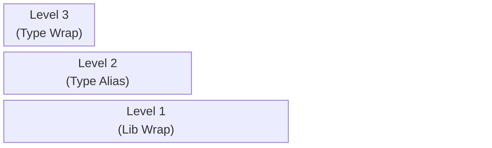
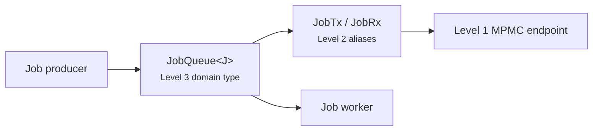

# Event Design

This guide describes an event/channel code design for the application messaging layer.

The goal of this design is to provide a channel-normalization API independent of the channel backend, then define patterns for specifying types across application domains.

The design has three levels:



- **Level 1**, normalizes all xPxC topologies from the selected backend
  - It provides endpoint pairs such as `MpscTx<M>` / `MpscRx<M>`, `MpmcTx<M>` / `MpmcRx<M>`, and `SpscTx<M>` / `SpscRx<M>`. (could be in path `src/event_base/`)
- **Level 2**, defines type aliases, or thin type wrappers when needed, over Level 1 for a particular use case.
  - For example, `type TuiTx = MpscTx<TuiEvent>` and `type TuiRx = MpscRx<TuiEvent>` retain the same `.send(...)` and `.recv(...)` API. (could be in path `src/tui/event.rs`)
- **Level 3**, defines domain types with domain functions.
  - For example, `JobQueue<Job>` can expose `JobQueue::get_job_todo(...)` instead of raw receiver operations.

This separation keeps channel implementation details out of domain code while allowing infrastructure to select the correct producer and consumer topology for each workflow.

Application code may depend on Level 2 or Level 3. 

- Use Level 2 when the call site is a plain send or receive of a use-case event. 
- Use Level 3 when the domain type would benefit of a more specific api than generic `.send(..)` and `.recv(...)`

> Note: We have standardized on [crossfire](https://crates.io/crates/crossfire) as the channel backend because it is one of the best in its class, but this architecture allows the backend to be swapped as desired.

## Level 1: Event-Base Facade

The `event_base` module is the boundary between application code and the channel backend. It exposes named endpoint wrappers, constructors, and application-owned errors without leaking Crossfire types or errors.

The reference implementation is in [`handbook/samples/event-design/src/event_base/`](../../../samples/event-design/src/event_base/).

### Channel Topologies

Choose a topology according to ownership, not according to a caller's convenience.

| Topology | Sender ownership   | Receiver ownership  | Use when                                                                |
| -------- | ------------------ | ------------------- | ----------------------------------------------------------------------- |
| MPSC     | Multiple producers | One consumer        | Many tasks, services, or components send work to one owner.             |
| MPMC     | Multiple producers | Competing consumers | Independent work should be distributed among a worker pool.             |
| SPSC     | One producer       | One consumer        | A dedicated producer and consumer exchange messages.                    |
| Oneshot  | One producer       | One consumer        | A single reply, acknowledgement, result, or completion value is needed. |

MPSC, MPMC, and SPSC channels are long-lived streaming channels. Oneshot channels are consuming endpoints, each pair can send and receive at most one value.

### Named Endpoint Wrappers

Each endpoint stores a static channel name alongside its private backend handle. The name makes disconnection errors actionable without exposing backend diagnostics as part of the public API.

The facade owns wrappers such as:

- `MpscTx<T>` and `MpscRx<T>` - **Multi Producers, Single Consumer**
- `MpmcTx<T>` and `MpmcRx<T>` - **Multi Producers, Multi Consumers**
- `SpscTx<T>` and `SpscRx<T>` - **Single Producer, Single Consumer**
- `OnceTx<T>` and `OnceRx<T>` - **One Producer, One Consumer**

Only endpoint types whose topology permits duplication should implement `Clone`. For example, an MPSC sender may be cloned for multiple producers, while an SPSC sender must remain single-owner. Similarly, MPMC receivers may be cloned for competing consumers, while an MPSC receiver remains single-owner.

### Factory Functions

Factories are the only Level 1 code that constructs backend channels. They validate configuration, create the backend endpoints, and wrap them in application-owned types.

Bounded factories accept a channel name and capacity:

```rust
let (tx, rx) = new_mpsc_bounded::<Job>("job-dispatch", 256)?;
```

Default-capacity constructors provide a consistent baseline for channels that do not need a workload-specific capacity:

```rust
let (tx, rx) = new_mpsc_bounded_default::<Job>("job-dispatch")?;
```

A zero capacity is rejected before a backend channel is created. This produces `EventBaseError::InvalidCapacity`, which gives the caller the invalid capacity and channel name.

See [`event_new.rs`](../../../samples/event-design/src/event_base/event_new.rs) for the factory implementation and capacity validation.

### Normalized Errors

Level 1 exposes `EventBaseError` and `EventBaseResult<T>` as the stable error boundary.

```rust
pub type EventBaseResult<T> = core::result::Result<T, EventBaseError>;
```

The facade distinguishes three conditions:

- `InvalidCapacity`, a bounded channel was configured with zero capacity.
- `TxDisconnected`, a send failed because no receiver remains.
- `RxDisconnected`, a receive failed because no sender remains.

Peer disconnection is generally the normal shutdown signal for a channel. Callers can use `is_disconnected()` when shutdown handling is shared across send and receive paths.

See [`event_base_error.rs`](../../../samples/event-design/src/event_base/event_base_error.rs) for the error contract.

### Backend Encapsulation

The public facade must not expose backend endpoint types, backend error types, or backend-specific constructors. This protects the rest of the application from backend changes and ensures all channel operations follow the same error semantics.

The module root declares private implementation modules and selectively re-exports the facade API. See [`mod.rs`](../../../samples/event-design/src/event_base/mod.rs) for this boundary.

## Level 2: Use-Case Endpoint Aliases

Level 2 binds a Level 1 topology to a concrete message type and names the pair after its use case. A type alias is usually enough, the endpoints keep the Level 1 API such as `send`, `recv`, and `is_disconnected`.

```rust
pub type TuiTx = MpscTx<TuiEvent>;
pub type TuiRx = MpscRx<TuiEvent>;

pub fn new_tui_channel() -> EventBaseResult<(TuiTx, TuiRx)> {
	new_mpsc_bounded::<TuiEvent>("tui-event", 256)
}
```

Aliases give three benefits:

- The topology choice lives in one place, so it can change without rewriting call-site types.
- Signatures name the use case, `fn spawn_input_reader(tui_tx: TuiTx)` rather than `fn spawn_input_reader(tx: MpscTx<TuiEvent>)`.
- The channel name and capacity are set by a single constructor instead of at each construction site.

Use a newtype wrapper instead of an alias only when the use case must restrict or adapt the endpoint API, for example to expose only `send`, or to convert an incoming value into the channel message type. A wrapper still delegates to the Level 1 endpoint, it must not construct backend channels or translate backend errors.

## Level 3: Domain Types

Level 3 turns channels into domain components. A domain type owns its Level 2 endpoints and exposes functions named after business operations rather than channel operations.



For example, a job-processing domain may define a `JobQueue<J>` over an MPMC channel and expose only the operations producers and workers need.

```rust
pub struct JobQueue<J: Job> {
	job_tx: JobTx<J>,
	job_rx: JobRx<J>,
}

impl<J: Job> JobQueue<J> {
	pub fn new(name: &'static str) -> EventBaseResult<Self> {
		let (job_tx, job_rx) = new_mpmc_bounded::<J>(name, JOB_QUEUE_CAPACITY)?;
		Ok(Self { job_tx, job_rx })
	}

	pub async fn queue_job(&self, job: J) -> EventBaseResult<()> {
		self.job_tx.send(job).await
	}

	pub async fn get_job_todo(&self) -> EventBaseResult<J> {
		self.job_rx.recv().await
	}
}
```

### Domain Type Responsibilities

A Level 3 type should:

- Name each operation after the business concept, `queue_job` and `get_job_todo` rather than `send` and `recv`.
- Own the Level 2 endpoints it needs, including coordination across several channels.
- Hold the domain state or policy, such as capacity defaults, filtering, or reply routing.
- Attach a oneshot reply endpoint to a request when the caller needs exactly one result.
- Preserve Level 1 shutdown and error semantics unless the domain has a clear reason to add context.

A Level 3 type should not duplicate backend construction, translate backend errors directly, or expose backend endpoint types. Those responsibilities belong to Level 1 and Level 2.

### Choosing the Topology

Use the ownership model of the use case to select its Level 1 primitive, then record that choice in the Level 2 alias:

- A single event loop receiving updates from many components is an MPSC channel.
- A set of interchangeable workers pulling independent jobs is an MPMC channel.
- A dedicated pipeline stage connected to exactly one downstream stage is an SPSC channel.
- A request that requires exactly one result uses a oneshot channel.

Because the alias and its constructor are the only place the topology appears, a workload can move from MPSC to MPMC without changing Level 3 or application code.

## Implementation Reference

See [`handbook/samples/event-design/`](../../../samples/event-design/) 

The sample implementation demonstrates the Level 1 boundary:

```text
handbook/samples/event-design/src/event_base/
├── event_base_error.rs
├── event_new.rs
├── event_once.rs
├── event_spsc.rs
├── event_xpxc.rs
└── mod.rs
```

- `event_base_error.rs` defines the shared result and error contract.
- `event_new.rs` owns channel construction and bounded-capacity validation.
- `event_once.rs` owns single-use endpoint behavior.
- `event_spsc.rs` owns SPSC endpoint behavior.
- `event_xpxc.rs` owns long-lived multi-producer and multi-consumer endpoint behavior.
- `mod.rs` keeps implementation modules private and re-exports the public facade.

Use the sample as the implementation reference when adding operations or a new backend topology. Level 2 aliases and Level 3 domain types live in their own domain modules, not in `event_base`. Keep this guide focused on the architectural boundary and ownership model.
